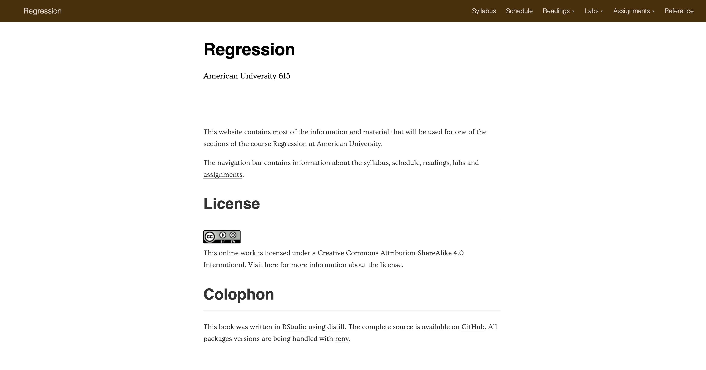

```{r include=FALSE}
library(knitr)
hook_output <- knit_hooks$get("output")
knit_hooks$set(output = function(x, options) {
  lines <- options$output.lines
  if (is.null(lines)) {
    return(hook_output(x, options))  # pass to default hook
  }
  x <- unlist(strsplit(x, "\n"))
  more <- "..."
  if (length(lines) == 1) {        # first n lines
    if (length(x) > lines) {
      # truncate the output, but add ....
      x <- c(head(x, lines), more)
    }
  } else {
    x <- c(more, x[lines], more)
  }
  # paste these lines together
  x <- paste(c(x, ""), collapse = "\n")
  hook_output(x, options)
})
knit_hooks$set(output = function(x, options) {
  # this hook is used only when the linewidth option is not NULL
  if (!is.null(n <- options$linewidth)) {
    x = knitr:::split_lines(x)
    # any lines wider than n should be wrapped
    if (any(nchar(x) > n)) x = strwrap(x, width = n)
    x = paste(x, collapse = '\n')
  }
  hook_output(x, options)
})

opts_chunk$set(
  echo = TRUE,
  fig.width = 7, 
  fig.align = 'center',
  fig.asp = 0.618, # 1 / phi
  out.width = "700px")
```

```{r, echo = FALSE}
library(sass)
sass(sass_file("theme.sass"), output = "theme.css")
```

# Welcome

--

- Introductions
- Syllabus
- Material
- Questions

---

# Questions

You are encouraged to ask questions when you have them rather than wait for me to ask for questions. If you have a question, chances are that something else has a question.

---

# Attendence and Camera

Both highly encouraged

Due to COVID-19 both should be practiced according to what makes you safe

---

# About Me

- Data Analyst at Teladoc Health
- R package developer, about 10 packages on CRAN (textrecipes, themis, paletteer, prismatic, textdata)
- Co-author of "Supervised Machine Learning for Text Analysis in R" to be published soon

---



---

# Syllabus

---

## An Introduction to Statistical Learning with Applications in R

Applied Linear Regression Models
4th edition or 5th edition

You can either buy the 4th or the 5th edition, BUT DO NOT BUY BOTH

---

## Syllabus

Come to me before it is too late

I'm here to help, my main goal for this course is to make you succeed

---

# Late assignment

There are some (limited) late penalties

It is more important for me that you turn something in then that you give up. You will always get points (sometimes reduced) for late assignments

Contact me if you are having a hard time or need to turn in late

---

# Lecture

40 + 15 + 40 + 15 + 40

---

# Labs

A hands-on section where we work together on the implementation side in R

These should be turned in WITH explanatory text.

---

# Assignments

There will be 10 assignments

It Will contain a mix of conceptual/statistical questions and practical coding exercises about the weekly topic

---

# Midterm

We will have a midterm halfway through the course

Will be a multi-day "take-home" test

The Midterm will cover multiple weeks of material

---

# Final Project

The project will be a document(20%) and a presentation given to the class(5%)

---

# Slack

Discussion place and questions

---

# Material 1/2

1. Introduction to R, notation, motivation, and examples. [1.1-1.2]
2. Linear regression: model, estimation, inference, prediction. Regression and correlation. R2. [Chap. 1-2]
3. Regression diagnostics: non-normality, nonlinearity, heteroscedasticity [Chap. 3]
4. Simultaneous estimation. Other regression models [Chap. 4]
5. Multiple regression. Matrix approach (Stat-615). Analysis of variance. Analysis of residuals. Partial correlation and multiple correlation coefficient. [Chap. 5-6]

---

# Material 2/2

6. Model building. Model selection and validation. Extra sum of squares. [Chap. 7-8]
7. Regression diagnostics-II. Influential observations and outliers. Effect of multicollinearity. Robust regression. Ridge regression [Chap. 9-10]
8. Regression diagnostics-III. Symptoms and remedies. Transformation of variables. Missing data. Analysis of covariance. Comparison of regression lines. [Chap. 10]
9. Dummy variables and related methods [Chap. 11]
10. (If time permits) Nonlinear relations. Logistic regression. [Chap. 13-14]
